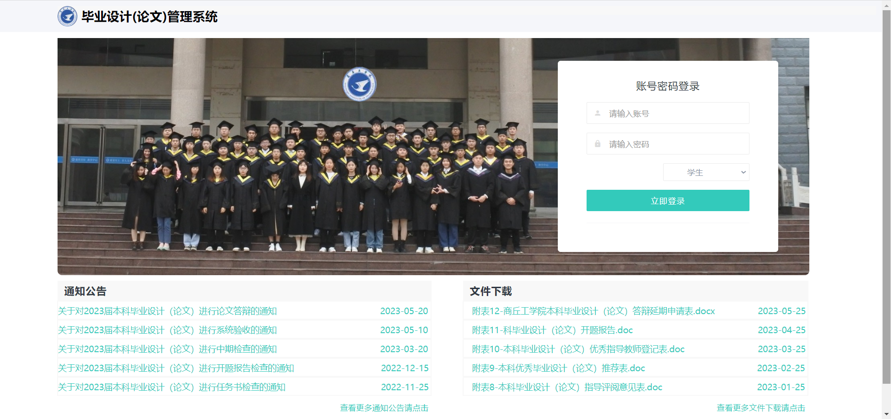

## 1、简介

&emsp;&emsp;本科毕业设计，基于SSM+Bootstrap 的毕业设计管理系统，主要功能有学生选题以及各个时间段的任务提交，老师审核学生论文内容和管理员对基本信息的管理。

---

## 2、项目演示

在线演示地址：http://180.76.56.118:8080/Graduation-Design-Management-System/

测试账号：

- admin/admin
- 20010/20010
- 3119010101/3119010101

---

## 3、系统功能

#### 学生

- 登录、注销
- 查看、修改个人信息
- 浏览、选择课题
- 上传任务书、开题报告、初稿、定稿、附件等
- 浏览新闻、下载附件
- 查看教师信息
- 查看成绩单

#### 管理员

登录、注销

添加、删除、修改新闻

对教师信息的更新、修改、删除和维护

对学生信息的更新、修改、删除和维护

成绩总汇

#### 教师

登录、注销

查看、修改教师个人信息

课题管理（添加、修改、删除课题）

查看我指导的学生

管理我的学生（修改学生信息（学号、姓名、电子邮件、电话等））

指导评分(录入指导评分，评语录入)

答辩评分(录入答辩评分，评语录入)

论文评分(录入论文评分，评语录入)

答辩成绩汇总（所有我参与答辩的学生的答辩成绩的汇总）

对学生教师进行答辩分组（**专业负责人**）

管理答辩组相关工作（**答辩组长**）

---

